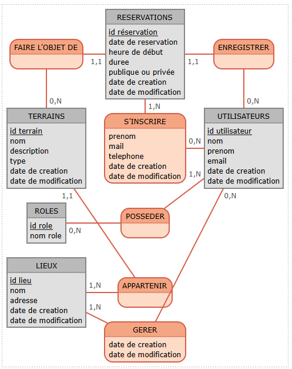

# API Rest

## API Rest conçue avec Java Spring Boot

### Permettant la gestion/réservation de courts de padel, tennis ou squash (évolutif)
### Différents rôles : user, manager, admin. 

### Un user (joueur) peut réserver un court, en réservation publique ou privée, y ajouter des invités.
### D'autres joueurs peuvent se positionner sur les réservations publiques et y ajouter aussi des éventuels invités.

### Un manager peut créer des lieux et y associer des courts. Un manager peut gérer l'ensemble des réservations/participations tant qu'elles sont liées à un court dont il est le manager.

### Un admin peut tout faire.

## SWAGGER UI
Hébergée sur Render.com en mode gratuit
https://java-api-rest-raquettelover-server.onrender.com/api/v1/swagger-ui/index.html
=> L'accès au swagger peut prendre plusieurs dizaines de secondes le temps que le serveur gratuit se réveille.